# 名词解释

## spring boot

```
Spring Boot是一个基于Spring的套件，它帮我们预组装了Spring的一系列组件，以便以尽可能少的代码和配置来开发基于Spring的Java应用程序。
```

## spring

```
Spring是一个支持快速开发Java EE应用程序的框架。它提供了一系列底层容器和基础设施，并可以和大量常用的开源框架无缝集成，可以说是开发Java EE应用程序的必备。
```

## Java EE

```
Java EE平台构建于Java SE平台之上，Java EE平台提供一组API和运行环境来开发和运行大规模的，多层的，可扩展的，可靠的和安全的网络应用程序。
```

## Java SE

```
 除了核心的API，Java SE平台由一个虚拟机，开发工具和其他的类库以及通常被Java应用程序使用的工具箱组成。
```

## Java ME

```
Java ME平台提供一组API和一个精简的JVM来在小型的设备或者手机上运行Java语言， 他的API是Java SE API的子集， Java ME应用程序通常是Java EE 平台服务的客户端。
```

## Java技术

```
Java技术不仅是一门编程语言而且是一个平台。同时Java语言是一门有着特定语法和风格的高级的面向对象的语言，Java平台是Java语言编写的特定应用程序运行的环境。
```

## JavaFX

```
JavaFX是一个用于创建RIA的平台，类似于Windows 平台的WPF，JavaFX使用硬件加速和多媒体引擎来更好的发挥高性能客户端的性能，并且得到一个现代的视觉体验，同时提供了一组高级的API来链接网络数据资源，JavaFX应用程序可以是Java EE 平台服务的客户端。
```

## 容器

```
容器是一种为某种特定组件的运行提供必要支持的一个软件环境。
```

## Ioc容器

```
Spring的核心就是提供了一个IoC容器
IoC全称Inversion of Control，直译为控制反转
```

## JDK（Java开发者工具）

```
Java Development Kit
JDK除了包含JRE，还提供了编译器、调试器等开发工具。
```

## JRE（Java运行环境）

```
Java Runtime Environment
JRE就是运行Java字节码的虚拟机。
```

## JSR（JSR规范）

```
Java Specification Request
JSR是一系列的规范，从JVM的内存模型到Web程序接口，全部都标准化了
```

## JCP（Java社区组织）

```
Java Community Process
负责审核JSR的组织就是JCP
```

## IDE（集成开发环境）

```
Integrated Development Environment
使用IDE的好处在于，可以把编写代码、组织项目、编译、运行、调试等放到一个环境中运行，能极大地提高开发效率。
```

## 魔数

```
1）指的是代码中出现的没有说明的数字;
2）i = 0x5f3759df - ( i >> 1 );
3）某些具有特定格式的文件，喜欢在文件开头写几个特殊的字符以表明自己的身份，以便验明正身。
```

## Uniode字符


## 事务

```
事务就是把一系列的动作当成一个独立的工作单元，这些动作要么全部完成，要么全部不起作用。就是把一系列的操作当成原子性去执行。
```

事务四个属性ACID
1、原子性（atomicity）

​	事务是原子性操作，由一系列动作组成，事务的原子性确保动作要么全部完成，要么完全不起作用

2、一致性（consistency）

​	一旦所有事务动作完成，事务就要被提交。数据和资源处于一种满足业务规则的一致性状态中

3、隔离性（isolation）

​	可能多个事务会同时处理相同的数据，因此每个事务都应该与其他事务隔离开来，防止数据损坏

4、持久性（durability）

​	事务一旦完成，无论系统发生什么错误，结果都不会受到影响。通常情况下，事务的结果被写到持久化存储器中


## AOP

```
Aspect Oriented Programming（面向切面编程）
```

## OOP

```
Object Oriented Programming（面向对象编程）
```

## JavaBEAN（Java组件）

```
Java程序中一些符合某种规范的类组合在一起形成的组件。
JavaBean是一种可重用的Java组件，它可以被Applet、Servlet、JSP等Java应用程序调用．也可以可视化地被Java开发工具使用。它包含属性(Properties)、方法(Methods)、事件(Events)等特性。
```

## 声明式事务

```
在配置文件中声明。用在Spring配置文件中声明式的处理事务来代替代码式的处理事务。这样的好处是，事务管理不侵入开发的组件；
```

## 反射

```
反射就是Reflection，Java的反射是指程序在运行期可以拿到一个对象的所有信息。
```


# spring boot

## 简介

​	使用 Spring Boot 可以很容易地创建出能直接运行的独立的、生产级别的基于 Spring 的应用。

​	您可以使用 Spring Boot 来创建一个可以使用 `java -jar` 命令来运行或者基于传统的 war 包部署的应用程序。我们还提供了一个用于运行 spring scripts 的命令行工具。

我们的主要目标是：

- 为所有 Spring Boot 开发提供一个更快、更全面的入门体验。
- 坚持自我虽好，但当需求出现偏离，您需要能迅速摆脱出来。
- 提供大量非功能性特性相关项目（例如：内嵌服务器、安全、指标、健康检查、外部配置)。
- 绝对没有代码生成，也不要求 XML 配置。

## 系统环境要求

​	Spring Boot 1.5.4.RELEASE 需要 [Java 7](https://www.java.com/) 和 Spring Framework 4.3.9.RELEASE 或者更高版本。

​	Spring Boot 为 Maven（3.2+），和 Gradle 2（2.9 或者更高版本）和 Gradle 3 提供了显式构建支持。

# 容器

​	容器是一种为某种特定组件的运行提供必要支持的一个软件环境。

​	通常来说，使用容器运行组件，除了提供一个组件运行环境之外，容器还提供了许多底层服务。

```
例如，Tomcat就是一个Servlet容器，它可以为Servlet的运行提供运行环境。类似Docker这样的软件也是一个容器，它提供了必要的Linux环境以便运行一个特定的Linux进程。
```


## IoC容器

​	Spring的核心就是提供了一个IoC容器，它可以管理所有轻量级的JavaBean组件，提供的底层服务包括组件的生命周期管理、配置和组装服务、AOP支持，以及建立在AOP基础上的声明式事务服务等。

## Servlet 容器

​	其实 *Servlet* 容器只不过是一个 Java 程序。

​	Servlet容器底层实现了TCP连接，解析HTTP协议等非常复杂的服务，如果没有容器来提供这些服务，我们就无法编写像Servlet这样代码简单，功能强大的组件。

​	什么是Servlet容器：https://blog.csdn.net/fg881218/article/details/89716366


# Java快速入门

## 简介&&说明

```
Java介于编译型语言和解释型语言之间。
```

```
编译型语言如C、C++，代码是直接编译成机器码执行，但是不同的平台（x86、ARM等）CPU的指令集不同，因此，需要编译出每一种平台的对应机器码。
```

```
解释型语言如Python、Ruby没有这个问题，可以由解释器直接加载源码然后运行，代价是运行效率太低。
```

```
Java是将代码编译成一种“字节码”，它类似于抽象的CPU指令，然后，针对不同平台编写虚拟机，不同平台的虚拟机负责加载字节码并执行，这样就实现了“一次编写，到处运行”的效果。
```

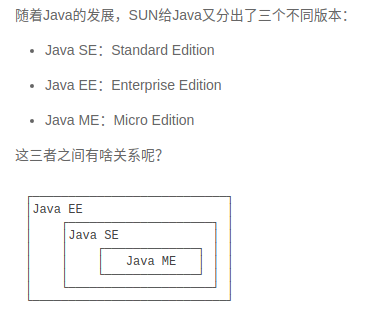

​	Java SE就是标准版，包含标准的JVM和标准库；

​	Java EE是企业版，它只是在Java SE的基础上加上了大量的API和库，以便方便开发Web应用、数据库、消息服务等，Java EE的应用使用的虚拟机和Java SE完全相同。

​	Java ME就和Java SE不同，它是一个针对嵌入式设备的“瘦身版”，Java SE的标准库无法在Java ME上使用，Java ME的虚拟机也是“瘦身版”。	

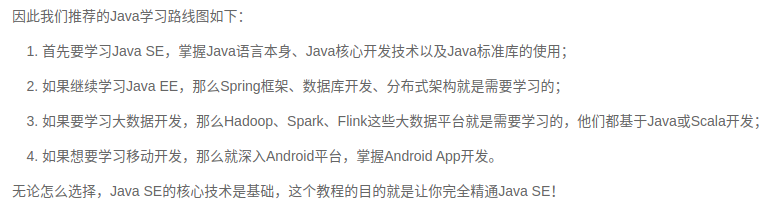

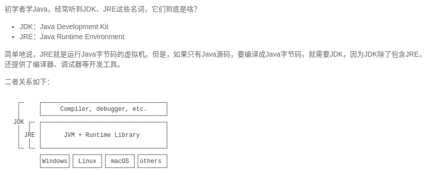

## 环境搭建

```
1）官网下载安装JDK
2）设置环境变量JAVA_HOME
3）添加JAVA_HOME的bin目录（是为了在任意文件夹下都可以运行java）
4）检查java版本
```

## 环境说明

​	在JAVA_HOME的bin目录下找到很多可执行文件：

```
java：这个可执行程序其实就是JVM，运行Java程序，就是启动JVM，然后让JVM执行指定的编译后的代码；
javac：这是Java的编译器，它用于把Java源码文件（以.java后缀结尾）编译为Java字节码文件（以.class后缀结尾）；
jar：用于把一组.class文件打包成一个.jar文件，便于发布；
javadoc：用于从Java源码中自动提取注释并生成文档；
jdb：Java调试器，用于开发阶段的运行调试。
```

## 万能的Hello World

```
public class Hello {
    public static void main(String[] args) {
        System.out.println("Hello, world!");
    }
}
```

```
public class Hello {
//public表示这个类是公开的
//class表示类
//类名是Hello，大小写敏感
    public static void main(String[] args) {
    //定义了一个名为main的方法
    //方法是可执行的代码块，一个方法除了方法名main，还有用()括起来的方法参数
    //public、static用来修饰方法，这里表示它是一个公开的静态方法
    //void是方法的返回类型
    //Java规定，某个类定义的public static void main(String[] args)是Java程序的固定入口方法，因此，Java程序总是从main方法开始执行。
        System.out.println("Hello, world!");
        //方法的代码每一行用;结束
    }
}
//当我们把代码保存为文件时，文件名必须是Hello.java，而且文件名也要注意大小写，因为要和我们定义的类名Hello完全保持一致。
```

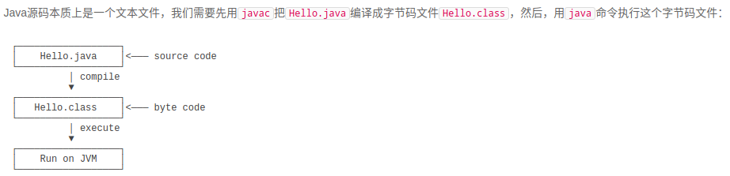

```
一个Java源码只能定义一个public类型的class，并且class名称和文件名要完全一致；
使用javac可以将.java源码编译成.class字节码；
使用java可以运行一个已编译的Java程序，参数是类名。
```

## IDE

```
Eclipse
	Eclipse是由IBM开发并捐赠给开源社区的一个IDE
IntelliJ Idea
	IntelliJ Idea是由JetBrains公司开发的一个功能强大的IDE，分为免费版和商用付费版。
NetBeans
	NetBeans是最早由SUN开发的开源IDE
```

## Java基础

### 基本结构

```
/**
 * 可以用来自动创建文档的注释
 */
public class Hello {
    public static void main(String[] args) {
        // 向屏幕输出文本:
        System.out.println("Hello, world!");
        /* 多行注释开始
        注释内容
        注释结束 */
    }
} // class定义结束
```

​	一个程序的基本单位就是class

```
类名要求：
类名必须以英文字母开头，后接字母，数字和下划线的组合
习惯以大写字母开头
```

​	在`class`内部，可以定义若干方法（method）

```
public class Hello {
    public static void main(String[] args) { // 方法名是main
        // 方法代码...
    } // 方法定义结束
}
方法名是`main`，返回值是`void`，表示没有任何返回值。
```

​	Java入口程序规定的方法必须是静态方法，方法名必须为`main`，括号内的参数必须是String数组。

​	方法定义了一组执行语句，方法内部的代码将会被依次顺序执行。

​	在方法内部，语句才是真正的执行代码。Java的每一行语句必须以分号结束

​	Java有3种注释，第一种是单行注释，以双斜线开头，直到这一行的结尾结束

```
// 这里是单行注释
/* 
这里是多行注释
*/
/**
 * 这里是文档注释
 */
```

### 变量&&数据类型

```
在Java中，变量必须先定义后使用，在定义变量的时候，可以给它一个初始值。
不写初始值，就相当于给它指定了默认值。默认值总是0
变量的一个重要特点是可以重新赋值。
```

#### 基本类型的变量

- 整数类型：byte，short，int，long
- 浮点数类型：float，double
- 字符类型：char
- 布尔类型：boolean

```
	计算机内存的最小存储单元是字节（byte），一个字节就是一个8位二进制数，即8个bit。它的二进制表示范围从00000000~11111111，换算成十进制是0~255，换算成十六进制是00~ff。
	内存单元从0开始编号，称为内存地址。每个内存单元可以看作一间房间，内存地址就是门牌号。
```

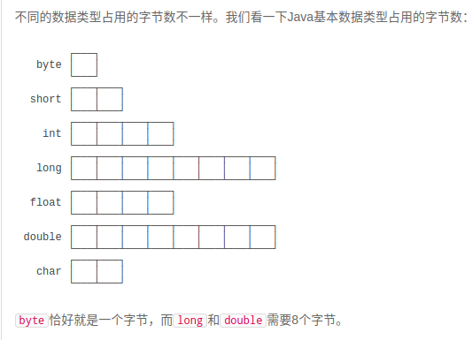

```
Java语言对布尔类型的存储并没有做规定，因为理论上存储布尔类型只需要1 bit，但是通常JVM内部会把boolean表示为4字节整数。
```

```
	对于整型类型，Java只定义了带符号的整型，因此，最高位的bit表示符号位（0表示正数，1表示负数）。
```

```
	00000000到01111111，表示0到+127。10000001到11111111，表示-1到-127。大家可以注意到，10000000我们没有用到。因为如果我们把它看成-0，那么会和00000000发生重复。于是计算机将10000000定义为-128(即在最终进位后符号位不产生进位)。
```

```
	字符类型char表示一个字符。Java的char类型除了可表示标准的ASCII外，还可以表示一个Unicode字符。
	注意char类型使用单引号'，且仅有一个字符，要和双引号"的字符串类型区分开。
```

#### 引用类型的变量

​	string字符串

```
引用类型的变量类似于C语言的指针，它内部存储一个“地址”，指向某个对象在内存的位置
```

​	常量

```
定义变量的时候，如果加上final修饰符，这个变量就变成了常量。
常量在定义时进行初始化后就不可再次赋值，再次赋值会导致编译错误。
常量的作用是用有意义的变量名来避免魔术数字（Magic number）
根据习惯，常量名通常全部大写。
```

​	var关键字

```
使用var定义变量，仅仅是少写了变量类型而已。

编译器会根据赋值语句自动推断出变量sb的类型是StringBuilder
var sb = new StringBuilder();
实际上会自动变成：
StringBuilder sb = new StringBuilder();
```

#### 变量作用域

```
在Java中，多行语句用{ }括起来；
只要正确地嵌套这些{ }，编译器就能识别出语句块的开始和结束；
在语句块中定义的变量，它有一个作用域，就是从定义处开始，到语句块结束。超出了作用域引用这些变量，编译器会报错；
```

### 运算

```
	整数的数值表示不但是精确的，而且整数运算永远是精确的，即使是除法也是精确的，因为两个整数相除只能得到结果的整数部分：
	整数的除法对于除数为0时运行时将报错，但编译不会报错。
```

```
	整数由于存在范围限制，如果计算结果超出了范围，就会产生溢出，而溢出不会出错，却会得到一个奇怪的结果
```

```
简写的运算符，即+=，-=，*=，/=
提供了++运算和--运算，它们可以对一个整数进行加1和减1的操作
```

```
移位  <<  >>
	如果对一个负数进行右移，最高位的1不动，结果仍然是一个负数
无符号的右移运算，使用>>>
	不管符号位，右移后高位总是补0
位运算是按位进行与、或、非和异或的运算。
	&  |  ~  ^
```

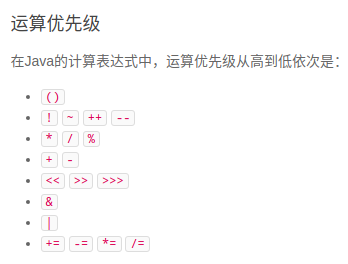

```
在运算过程中，如果参与运算的两个数类型不一致，那么计算结果为较大类型的整型
强制转型使用(类型)
超出范围的强制转型会得到错误的结果，原因是转型时，int的两个高位字节直接被扔掉，仅保留了低位的两个字节;
```

### 浮点运算

```
	由于浮点数存在运算误差，所以比较两个浮点数是否相等常常会出现错误的结果。正确的比较方法是判断两个浮点数之差的绝对值是否小于一个很小的数
```

整数运算在除数为`0`时会报错，而浮点数运算在除数为`0`时，不会报错，但会返回几个特殊值：

- `NaN`表示Not a Number
- `Infinity`表示无穷大
- `-Infinity`表示负无穷大

### 布尔运算

```
	对于布尔类型boolean，永远只有true和false两个值。
	布尔运算的一个重要特点是短路运算。如果一个布尔运算的表达式能提前确定结果，则后续的计算不再执行，直接返回结果。
```


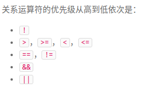

```
	Java还提供一个三元运算符b ? x : y，它根据第一个布尔表达式的结果，分别返回后续两个表达式之一的计算结果。
```

### 字符串

​	在Java中，字符和字符串是两个不同的类型。

​	字符类型`char`是基本数据类型，它是`character`的缩写。一个`char`保存一个Unicode字符：

​	因为Java在内存中总是使用Unicode表示字符，所以，一个英文字符和一个中文字符都用一个`char`类型表示，它们都占用两个字节。要显示一个字符的Unicode编码，只需将`char`类型直接赋值给`int`类型即可。

​	字符串类型`String`是引用类型，我们用双引号`"..."`表示字符串。一个字符串可以存储0个到任意个字符。

​	特殊字符需要转义

常见的转义字符包括：

- `\"` 表示字符`"`
- `\'` 表示字符`'`
- `\\` 表示字符`\`
- `\n` 表示换行符
- `\r` 表示回车符
- `\t` 表示Tab
- `\u####` 表示一个Unicode编码的字符

​	Java的编译器对字符串做了特殊照顾，可以使用`+`连接任意字符串和其他数据类型，这样极大地方便了字符串的处理。

​	如果用`+`连接字符串和其他数据类型，会将其他数据类型先自动转型为字符串，再连接。

​	从Java 13开始，字符串可以用`"""..."""`表示多行字符串（Text Blocks）了。

```
"""
 Text Block
"""
```

​	Java的字符串除了是一个引用类型外，还有个重要特点，就是字符串不可变。

​	执行`String s = "hello";`时，JVM虚拟机先创建字符串`"hello"`，然后，把字符串变量`s`指向它；

​	执行`s = "world";`时，JVM虚拟机先创建字符串`"world"`，然后，把字符串变量`s`指向它；

​	字符串的不可变是指字符串内容不可变。


​	引用类型的变量可以指向一个空值`null`，它表示不存在，即该变量不指向任何对象。

​	空字符串是一个有效的字符串对象，它不等于`null`。

### 数组

​	定义一个数组类型的变量，使用数组类型“类型[]”，例如，`int[]`。和单个基本类型变量不同，数组变量初始化必须使用`new int[5]`表示创建一个可容纳5个`int`元素的数组。

```java
int[] ns = new int[5];
```

- 数组所有元素初始化为默认值，整型都是`0`，浮点型是`0.0`，布尔型是`false`；
- 数组一旦创建后，大小就不可改变。

​	可以用`数组变量.length`获取数组大小；

​	数组是引用类型，在使用索引访问数组元素时，如果索引超出范围，运行时将报错；

​	数组是同一数据类型的集合，数组一旦创建后，大小就不可变；

​	可以通过索引访问数组元素，但索引超出范围将报错；

​	数组元素可以是值类型（如int）或引用类型（如String），但数组本身是引用类型；

### 流程控制

#### 输出

​	`println`是print line的缩写，表示输出并换行。如果输出后不想换行，可以用`print()`：

​	如果要把数据显示成我们期望的格式，就需要使用格式化输出的功能。

```java
System.out.print		//输出
System.out.println		//输出+换行
System.out.print		//格式输出
```

​	Java的格式化功能提供了多种占位符，可以把各种数据类型“格式化”成指定的字符串；


#### 输入

​	我们通过`import`语句导入`java.util.Scanner`，`import`是导入某个类的语句，必须放到Java源代码的开头；

​	创建`Scanner`对象并传入`System.in`。

​	`System.out`代表标准输出流，而`System.in`代表标准输入流。

​	直接使用`System.in`读取用户输入虽然是可以的，但需要更复杂的代码，而通过`Scanner`就可以简化后续的代码。

​	有了`Scanner`对象后，要读取用户输入的字符串，使用`scanner.nextLine()`，要读取用户输入的整数，使用`scanner.nextInt()`。`Scanner`会自动转换数据类型，因此不必手动转换。

#### IF判断

```java
if (条件) {
    // 条件满足时执行
} else {
    // 条件不满足
} else if(条件) {
    // 
}
```

​	根据`if`的计算结果（`true`还是`false`），JVM决定是否执行`if`语句块（即花括号{}包含的所有语句）。

​	判断值类型的变量是否相等，可以使用`==`运算符。但是，判断引用类型的变量是否相等，`==`表示“引用是否相等”，或者说，是否指向同一个对象。

​	要判断引用类型的变量内容是否相等，必须使用`equals()`方法；

#### switch分组

```java
switch (option) {
case A:
	// todo
    break;
case B:
	// todo
    break;
default:
	// todo
    break;
}
```

#### while循环

```java
while (option) {
	// todo;
}
```

#### do-while循环

```java
do {
	// todo;
} while (option);
```

#### for循环

​	`for`循环的功能非常强大，它使用计数器实现循环。`for`循环会先初始化计数器，然后，在每次循环前检测循环条件，在每次循环后更新计数器。计数器变量通常命名为`i`。

​	在`for`循环执行前，会先执行初始化语句`int i=1`，它定义了计数器变量`i`并赋初始值为`1`，然后，循环前先检查循环条件`i<=100`，循环后自动执行`i++`

```java
for (初始条件;循环检查条件;计数器自增) {
	// todo;
}
```

​	for each

```java
int[] ns = { 1, 4, 9, 16, 25 };
for (int n : ns) {
    System.out.println(n);
}
```

#### break && continue

​	`break`语句总是跳出自己所在的那一层循环；

​	`continue`则是提前结束本次循环，直接继续执行下次循环。

### 数组操作

#### 遍历数组

​	`Arrays.toString()`，可以快速打印数组内容；

#### 数组排序

​	冒泡排序的特点是，每一轮循环后，最大的一个数被交换到末尾，因此，下一轮循环就可以“刨除”最后的数，每一轮循环都比上一轮循环的结束位置靠前一位。

​	JDK提供的`Arrays.sort()`就可以排序

#### 多维数组

​	打印二维数组内容Arrays.deepToString()；

#### 命令行参数

​	Java程序的入口是`main`方法，而`main`方法可以接受一个命令行参数，它是一个`String[]`数组。

​	这个命令行参数由JVM接收用户输入并传给`main`方法：

# 面向对象编程

### 面向对象基础

​		面向对象编程，是一种通过对象的方式，把现实世界映射到计算机模型的一种编程方法。

​	“人”可以定义为一个类（class），而具体的人则是实例（instance）

​	class是一种对象模版，它定义了如何创建实例，因此，class本身就是一种数据类型，而instance是对象实例，instance是根据class创建的实例，可以创建多个instance，每个instance类型相同，但各自属性可能不相同。

```java
class Person {
    public String name;
    public int age;
}
```

​	一个`class`可以包含多个字段（`field`），字段用来描述一个类的特征。上面的`Person`类，我们定义了两个字段，一个是`String`类型的字段，命名为`name`，一个是`int`类型的字段，命名为`age`。因此，通过`class`，把一组数据汇集到一个对象上，实现了数据封装。

​	`public`是用来修饰字段的，它表示这个字段可以被外部访问。

​	定义了class，只是定义了对象模版，而要根据对象模版创建出真正的对象实例，必须用new操作符。

​	一个Java源文件可以包含多个类的定义，但只能定义一个public类，且public类名必须与文件名一致。如果要定义多个public类，必须拆到多个Java源文件中。

​	在OOP中，`class`和`instance`是“模版”和“实例”的关系；

​	定义`class`就是定义了一种数据类型，对应的`instance`是这种数据类型的实例；

​	`class`定义的`field`，在每个`instance`都会拥有各自的`field`，且互不干扰；

​	通过`new`操作符创建新的`instance`，然后用变量指向它，即可通过变量来引用这个`instance`；

​	访问实例字段的方法是`变量名.字段名`；

​	指向`instance`的变量都是引用变量。	

#### 方法

​	保障内部数据的安全性；

​	直接把`field`用`public`暴露给外部可能会破坏封装性。

​	避免外部代码直接去访问`field`，我们可以用`private`修饰`field`，拒绝外部访问，使用方法（`method`）来让外部代码可以间接修改`field`。

​	虽然外部代码不能直接修改字段，但是，外部代码可以调用方法来间接修改字段。在方法内部，我们就有机会检查参数对不对。

​	所以，一个类通过定义方法，就可以给外部代码暴露一些操作的接口，同时，内部自己保证逻辑一致性。

​	定义方法：

```java
修饰符 方法返回类型 方法名(方法参数列表) {
    若干方法语句;
    return 方法返回值;
}
```

​	方法返回值通过`return`语句实现，如果没有返回值，返回类型设置为`void`，可以省略`return`。

​	方法可以封装一个类的对外接口，调用方不需要知道也不关心实例在内部到底有没有需要的字段。

​	在方法内部，可以使用一个隐含的变量`this`，它始终指向当前实例。因此，通过`this.field`就可以访问当前实例的字段。如果没有命名冲突，可以省略`this`。

​	基本类型参数的传递，是调用方值的复制。双方各自的后续修改，互不影响。

​	引用类型参数的传递，调用方的变量，和接收方的参数变量，指向的是同一个对象。双方任意一方对这个对象的修改，都会影响对方（因为指向同一个对象嘛）。

#### 构造方法

​	构造方法：在创建对象实例时就把内部字段全部初始化为合适的值。

​	由于构造方法是如此特殊，所以构造方法的名称就是类名。构造方法的参数没有限制，在方法内部，也可以编写任意语句。但是，和普通方法相比，构造方法没有返回值（也没有`void`），调用构造方法，必须用`new`操作符。

​	如果我们自定义了一个构造方法，那么，编译器就*不再*自动创建默认构造方法；

​	有在构造方法中初始化字段时，引用类型的字段默认是`null`，数值类型的字段用默认值，`int`类型默认值是`0`，布尔类型默认值是`false`；

​	可以定义多个构造方法，在通过`new`操作符调用的时候，编译器通过构造方法的参数数量、位置和类型自动区分；

​	一个构造方法可以调用其他构造方法，这样做的目的是便于代码复用。调用其他构造方法的语法是`this(…)`

#### 方法重载

​	在一个类中，我们可以定义多个方法。如果有一系列方法，它们的功能都是类似的，只有参数有所不同，那么，可以把这一组方法名做成*同名*方法。

​	这种方法名相同，但各自的参数不同，称为方法重载（`Overload`）。

​	注意：方法重载的返回值类型通常都是相同的。

​	方法重载的目的是，功能类似的方法使用同一名字，更容易记住，因此，调用起来更简单。

#### 继承

​	继承是面向对象编程中非常强大的一种机制，它首先可以复用代码。当我们让`Student`从`Person`继承时，`Student`就获得了`Person`的所有功能，我们只需要为`Student`编写新增的功能。

​	Java使用`extends`关键字来实现继承。

​	子类自动获得了父类的所有字段，严禁定义与父类重名的字段！

​	在OOP的术语中，我们把`Person`称为超类（super class），父类（parent class），基类（base class），把`Student`称为子类（subclass），扩展类（extended class）。

​	Java只允许一个class继承自一个类，因此，一个类有且仅有一个父类。只有`Object`特殊，它没有父类。

​	继承有个特点，就是子类无法访问父类的`private`字段或者`private`方法。

​	为了让子类可以访问父类的字段，我们需要把`private`改为`protected`。用`protected`修饰的字段可以被子类访问。

​	因此，`protected`关键字可以把字段和方法的访问权限控制在继承树内部，一个`protected`字段和方法可以被其子类，以及子类的子类所访问。

​	`super`关键字表示父类（超类）。子类引用父类的字段时，可以用`super.fieldName`。

​	在Java中，任何`class`的构造方法，第一行语句必须是调用父类的构造方法。如果没有明确地调用父类的构造方法，编译器会帮我们自动加一句`super();`

​	如果父类没有默认的构造方法，子类就必须显式调用`super()`并给出参数以便让编译器定位到父类的一个合适的构造方法。

​	即子类*不会继承*任何父类的构造方法。子类默认的构造方法是编译器自动生成的，不是继承的。

​	从Java 15开始，允许使用`sealed`修饰class，并通过`permits`明确写出能够从该class继承的子类名称

```java
public sealed class Shape permits Rect, Circle, Triangle {
    ...
}
```

​	定义Shape类，它只允许指定的3个类继承它。

​	这是因为`Student`继承自`Person`，因此，它拥有`Person`的全部功能。`Person`类型的变量，如果指向`Student`类型的实例，对它进行操作，是没有问题的！

​	这种把一个子类类型安全地变为父类类型的赋值，被称为向上转型（upcasting）。

​	如果把一个父类类型强制转型为子类类型，就是向下转型（downcasting）。

```java
Person p1 = new Student(); // upcasting, ok
Person p2 = new Person();
Student s1 = (Student) p1; // ok
Student s2 = (Student) p2; // runtime error! ClassCastException!
```

​	`Person`类型`p1`实际指向`Student`实例，`Person`类型变量`p2`实际指向`Person`实例。在向下转型的时候，把`p1`转型为`Student`会成功，因为`p1`确实指向`Student`实例，把`p2`转型为`Student`会失败，因为`p2`的实际类型是`Person`，不能把父类变为子类，因为子类功能比父类多，多的功能无法凭空变出来。

​	`instanceof`实际上判断一个变量所指向的实例是否是指定类型，或者这个类型的子类。如果一个引用变量为`null`，那么对任何`instanceof`的判断都为`false`。

#### 多态

​	在继承关系中，子类如果定义了一个与父类方法签名完全相同的方法，被称为覆写（Override）。

​	Override和Overload不同的是，如果方法签名不同，就是Overload，Overload方法是一个新方法；如果方法签名相同，并且返回值也相同，就是`Override`。	

​	方法名相同，方法参数相同，但方法返回值不同，也是不同的方法。在Java程序中，出现这种情况，编译器会报错。

​	加上`@Override`可以让编译器帮助检查是否进行了正确的覆写。

```java
class Student extends Person {
    @Override
    public void run() {
        System.out.println("Student.run");
    }
}
```

​	一个实际类型为`Student`，引用类型为`Person`的变量，调用其`run()`方法，调用的是`Person`还是`Student`的`run()`方法？

​	实际上调用的方法是`Student`的`run()`方法

​	Java的实例方法调用是基于运行时的实际类型的动态调用，而非变量的声明类型。

​	多态是指，针对某个类型的方法调用，其真正执行的方法取决于运行时期实际类型的方法。

​	所以，多态的特性就是，运行期才能动态决定调用的子类方法。

​	可见，多态具有一个非常强大的功能，就是允许添加更多类型的子类实现功能扩展，却不需要修改基于父类的代码。	

​	继承可以允许子类覆写父类的方法。如果一个父类不允许子类对它的某个方法进行覆写，可以把该方法标记为`final`。用`final`修饰的方法不能被`Override`

​	如果一个类不希望任何其他类继承自它，那么可以把这个类本身标记为`final`。用`final`修饰的类不能被继承。

​	对于一个类的实例字段，同样可以用`final`修饰。用`final`修饰的字段在初始化后不能被修改。可以在构造方法中初始化final字段。

- 子类可以覆写父类的方法（Override），覆写在子类中改变了父类方法的行为；
- Java的方法调用总是作用于运行期对象的实际类型，这种行为称为多态；
- `final`修饰符有多种作用：
  - `final`修饰的方法可以阻止被覆写；
  - `final`修饰的class可以阻止被继承；
  - `final`修饰的field必须在创建对象时初始化，随后不可修改。

```java
  2   public static void main(String[] args) {                                                                                 
  3                                                                                                                           
  4     Income[] incomes = new Income[] {                                                                                     
  5       new Income(10000),                                                                                                   
  6       new Salary(20000)                                                                                                   
  7     };                                                                                                                     
  8     System.out.println(totalTax(incomes));                                                                                 
  9   }                                                                                                                       
 10                                                                                                                           
 11   public static double totalTax(Income... incomes) {                                                                       
 12     double total = 0;                                                                                                     
 13     for(Income income: incomes) {                                                                                         
 14       total += income.getTax();                                                                                           
 15     }                                                                                                                     
 16     return total;                                                                                                         
 17   }  
```

​	传递非固定数量的数组和循环；

#### 抽象类

​	如果父类的方法本身不需要实现任何功能，仅仅是为了定义方法签名，目的是让子类去覆写它，那么，可以把父类的方法声明为抽象方法：	

```java
class Person {
    public abstract void run();
}
```

​	把一个方法声明为`abstract`，表示它是一个抽象方法，本身没有实现任何方法语句。因为这个抽象方法本身是无法执行的，所以，`Person`类也无法被实例化。编译器会告诉我们，无法编译`Person`类，因为它包含抽象方法。必须把`Person`类本身也声明为`abstract`，才能正确编译它。

​	如果一个`class`定义了方法，但没有具体执行代码，这个方法就是抽象方法，抽象方法用`abstract`修饰。	

​	因为无法执行抽象方法，因此这个类也必须申明为抽象类（abstract class）。	

​	因为抽象类本身被设计成只能用于被继承，因此，抽象类可以强迫子类实现其定义的抽象方法，否则编译会报错。因此，抽象方法实际上相当于定义了“规范”。

​	当我们定义了抽象类`Person`，以及具体的`Student`、`Teacher`子类的时候，我们可以通过抽象类`Person`类型去引用具体的子类的实例：

​	这种引用抽象类的好处在于，我们对其进行方法调用，并不关心`Person`类型变量的具体子类型。

​	这种尽量引用高层类型，避免引用实际子类型的方式，称之为面向抽象编程。

​	面向抽象编程的本质就是：

- 上层代码只定义规范（例如：`abstract class Person`）；
- 不需要子类就可以实现业务逻辑（正常编译）；
- 具体的业务逻辑由不同的子类实现，调用者并不关心。

总结：

- 通过`abstract`定义的方法是抽象方法，它只有定义，没有实现。抽象方法定义了子类必须实现的接口规范；
- 定义了抽象方法的class必须被定义为抽象类，从抽象类继承的子类必须实现抽象方法；
- 如果不实现抽象方法，则该子类仍是一个抽象类；
- 面向抽象编程使得调用者只关心抽象方法的定义，不关心子类的具体实现。

#### 接口

​	在抽象类中，抽象方法本质上是定义接口规范：即规定高层类的接口，从而保证所有子类都有相同的接口实现，这样，多态就能发挥出威力。

​	如果一个抽象类没有字段，所有方法全部都是抽象方法，就可以把该抽象类改写为接口：`interface`。

```java
abstract class Person {
    public abstract void run();
    public abstract String getName();
}
```

​	在Java中，使用`interface`可以声明一个接口：

```java
interface Person {
    void run();
    String getName();
}
```

​	所谓`interface`，就是比抽象类还要抽象的纯抽象接口，因为它连字段都不能有。因为接口定义的所有方法默认都是`public abstract`的，所以这两个修饰符不需要写出来。

​	当一个具体的`class`去实现一个`interface`时，需要使用`implements`关键字。

​	在Java中，一个类只能继承自另一个类，不能从多个类继承。但是，一个类可以实现多个`interface`

```java
class Student implements Person, Hello { // 实现了两个interface
    ...
}
```

​	Java的接口特指`interface`的定义，表示一个接口类型和一组方法签名，而编程接口泛指接口规范，如方法签名，数据格式，网络协议等。

​	抽象类和接口的对比：

|            | abstract class       | interface                   |
| :--------- | :------------------- | --------------------------- |
| 继承       | 只能extends一个class | 可以implements多个interface |
| 字段       | 可以定义实例字段     | 不能定义实例字段            |
| 抽象方法   | 可以定义抽象方法     | 可以定义抽象方法            |
| 非抽象方法 | 可以定义非抽象方法   | 可以定义default方法         |

​	一个`interface`可以继承自另一个`interface`。`interface`继承自`interface`使用`extends`，它相当于扩展了接口的方法。

```java
interface Hello {
    void hello();
}

interface Person extends Hello {
    void run();
    String getName();
}
```

​	合理设计`interface`和`abstract class`的继承关系，可以充分复用代码。一般来说，公共逻辑适合放在`abstract class`中，具体逻辑放到各个子类，而接口层次代表抽象程度。可以参考Java的集合类定义的一组接口、抽象类以及具体子类的继承关系：

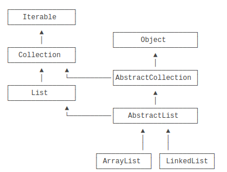

​	在使用的时候，实例化的对象永远只能是某个具体的子类，但总是通过接口去引用它，因为接口比抽象类更抽象：

```java
List list = new ArrayList(); // 用List接口引用具体子类的实例
Collection coll = list; // 向上转型为Collection接口
Iterable it = coll; // 向上转型为Iterable接口
```

​	在接口中，可以定义`default`方法。

​	实现类可以不必覆写`default`方法。`default`方法的目的是，当我们需要给接口新增一个方法时，会涉及到修改全部子类。如果新增的是`default`方法，那么子类就不必全部修改，只需要在需要覆写的地方去覆写新增方法。

​	`default`方法和抽象类的普通方法是有所不同的。因为`interface`没有字段，`default`方法无法访问字段，而抽象类的普通方法可以访问实例字段。

#### 静态字段和静态方法

​	在一个`class`中定义的字段，我们称之为实例字段。实例字段的特点是，每个实例都有独立的字段，各个实例的同名字段互不影响。

​	还有一种字段，是用`static`修饰的字段，称为静态字段：`static field`。

​	实例字段在每个实例中都有自己的一个独立“空间”，但是静态字段只有一个共享“空间”，所有实例都会共享该字段。

```java
class Person {
    public String name;
    public int age;
    // 定义静态字段number:
    public static int number;
}
```

​	对于静态字段，无论修改哪个实例的静态字段，效果都是一样的：所有实例的静态字段都被修改了，原因是静态字段并不属于实例：

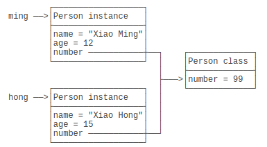

​	虽然实例可以访问静态字段，但是它们指向的其实都是`Person class`的静态字段。所以，所有实例共享一个静态字段。

​	因此，不推荐用`实例变量.静态字段`去访问静态字段，因为在Java程序中，实例对象并没有静态字段。在代码中，实例对象能访问静态字段只是因为编译器可以根据实例类型自动转换为`类名.静态字段`来访问静态对象。

​	推荐用类名来访问静态字段。可以把静态字段理解为描述`class`本身的字段（非实例字段）	

​	用`static`修饰的方法称为静态方法。

​	调用实例方法必须通过一个实例变量，而调用静态方法则不需要实例变量，通过类名就可以调用。静态方法类似其它编程语言的函数。

​	因为静态方法属于`class`而不属于实例，因此，静态方法内部，无法访问`this`变量，也无法访问实例字段，它只能访问静态字段。

​	通过实例变量也可以调用静态方法，但这只是编译器自动帮我们把实例改写成类名而已。

静态方法经常用于工具类。例如：

- Arrays.sort()
- Math.random()

静态方法也经常用于辅助方法。注意到Java程序的入口`main()`也是静态方法。

​	因为`interface`是一个纯抽象类，所以它不能定义实例字段。但是，`interface`是可以有静态字段的，并且静态字段必须为`final`类型：

```java
public interface Person {
    public static final int MALE = 1;
    public static final int FEMALE = 2;
}
```

​	实际上，因为`interface`的字段只能是`public static final`类型，所以我们可以把这些修饰符都去掉，上述代码可以简写为：

```java
public interface Person {
    // 编译器会自动加上public statc final:
    int MALE = 1;
    int FEMALE = 2;
}
```

​	编译器会自动把该字段变为`public static final`类型。

#### 包

​	在Java中，我们使用`package`来解决名字冲突。

​	ava定义了一种名字空间，称之为包：`package`。一个类总是属于某个包，类名（比如`Person`）只是一个简写，真正的完整类名是`包名.类名`。

​	在定义`class`的时候，我们需要在第一行声明这个`class`属于哪个包。

​	在Java虚拟机执行的时候，JVM只看完整类名，因此，只要包名不同，类就不同。

​	包没有父子关系。java.util和java.util.zip是不同的包，两者没有任何继承关系。

​	没有定义包名的`class`，它使用的是默认包，非常容易引起名字冲突，因此，不推荐不写包名的做法。	

​	编译的命令相对比较复杂，我们需要在`src`目录下执行`javac`命令：

```java
javac -d ../bin ming/Person.java hong/Person.java mr/jun/Arrays.java
```

​	位于同一个包的类，可以访问包作用域的字段和方法。不用`public`、`protected`、`private`修饰的字段和方法就是包作用域。

​	在一个`class`中，我们总会引用其他的`class`。

​	例如，小明的`ming.Person`类，如果要引用小军的`mr.jun.Arrays`类，他有三种写法：

```java
// Person.java
package ming;

public class Person {
    public void run() {
        mr.jun.Arrays arrays = new mr.jun.Arrays();
    }
}
```

​	第二种写法是用`import`语句，导入小军的`Arrays`，然后写简单类名：

```java
// Person.java
package ming;

// 导入完整类名:
import mr.jun.Arrays;

public class Person {
    public void run() {
        Arrays arrays = new Arrays();
    }
}
```

​	在写`import`的时候，可以使用`*`，表示把这个包下面的所有`class`都导入进来（但不包括子包的`class`）：

```java
// Person.java
package ming;

// 导入mr.jun包的所有class:
import mr.jun.*;

public class Person {
    public void run() {
        Arrays arrays = new Arrays();
    }
}
```

​	还有一种`import static`的语法，它可以导入可以导入一个类的静态字段和静态方法：

```java
package main;

// 导入System类的所有静态字段和静态方法:
import static java.lang.System.*;

public class Main {
    public static void main(String[] args) {
        // 相当于调用System.out.println(…)
        out.println("Hello, world!");
    }
}
```

​	Java编译器最终编译出的`.class`文件只使用*完整类名*，因此，在代码中，当编译器遇到一个`class`名称时：

- 如果是完整类名，就直接根据完整类名查找这个`class`；
- 如果是简单类名，按下面的顺序依次查找：
  - 查找当前`package`是否存在这个`class`；
  - 查找`import`的包是否包含这个`class`；
  - 查找`java.lang`包是否包含这个`class`。

编写class的时候，编译器会自动帮我们做两个import动作：

- 默认自动`import`当前`package`的其他`class`；
- 默认自动`import java.lang.*`。

​	如果有两个`class`名称相同，例如，`mr.jun.Arrays`和`java.util.Arrays`，那么只能`import`其中一个，另一个必须写完整类名。

Java内建的`package`机制是为了避免`class`命名冲突；

JDK的核心类使用`java.lang`包，编译器会自动导入；

JDK的其它常用类定义在`java.util.*`，`java.math.*`，`java.text.*`，……；

包名推荐使用倒置的域名，例如`org.apache`。


#### 作用域

public

​	定义为`public`的`class`、`interface`可以被其他任何类访问；

​	定义为`public`的`field`、`method`可以被其他类访问，前提是首先有访问`class`的权限；

private

​	定义为`private`的`field`、`method`无法被其他类访问；

​	确切地说，`private`访问权限被限定在`class`的内部，而且与方法声明顺序*无关*。推荐把`private`方法放到后面，因为`public`方法定义了类对外提供的功能，阅读代码的时候，应该先关注`public`方法。

protected

​	`protected`作用于继承关系。定义为`protected`的字段和方法可以被子类访问，以及子类的子类；

package

​	包作用域是指一个类允许访问同一个`package`的没有`public`、`private`修饰的`class`，以及没有`public`、`protected`、`private`修饰的字段和方法。

​	只要在同一个包，就可以访问`package`权限的`class`、`field`和`method`

局部变量

​	在方法内部定义的变量称为局部变量，局部变量作用域从变量声明处开始到对应的块结束。方法参数也是局部变量。

​	使用局部变量时，应该尽可能把局部变量的作用域缩小，尽可能延后声明局部变量。

final

​	`final`与访问权限不冲突，它有很多作用。

​	用`final`修饰`class`可以阻止被继承。

​	用`final`修饰`method`可以阻止被子类覆写。

​	用`final`修饰`field`可以阻止被重新赋值。

​	用`final`修饰局部变量可以阻止被重新赋值。

总结

​	如果不确定是否需要`public`，就不声明为`public`，即尽可能少地暴露对外的字段和方法。

​	把方法定义为`package`权限有助于测试，因为测试类和被测试类只要位于同一个`package`，测试代码就可以访问被测试类的`package`权限方法。

​	一个`.java`文件只能包含一个`public`类，但可以包含多个非`public`类。如果有`public`类，文件名必须和`public`类的名字相同。

​	Java内建的访问权限包括`public`、`protected`、`private`和`package`权限；

#### 内部类

​	通常情况下，我们把不同的类组织在不同的包下面，对于一个包下面的类来说，它们是在同一层次，没有父子关系；

​	还有一种类，它被定义在另一个类的内部，所以称为内部类（Nested Class）。

Inner Class

​	如果一个类定义在另一个类的内部，这个类就是Inner Class；

```java
class Outer {
    class Inner {
        // 定义了一个Inner Class
    }
}
```

​	上述定义的`Outer`是一个普通类，而`Inner`是一个Inner Class，它与普通类有个最大的不同，就是Inner Class的实例不能单独存在，必须依附于一个Outer Class的实例。

```java
public class Main {
    public static void main(String[] args) {
        Outer outer = new Outer("Nested"); // 实例化一个Outer
        Outer.Inner inner = outer.new Inner(); // 实例化一个Inner
        inner.hello();
    }
}

class Outer {
    private String name;

    Outer(String name) {
        this.name = name;
    }

    class Inner {
        void hello() {
            System.out.println("Hello, " + Outer.this.name);
        }
    }
}
```

​	要实例化一个`Inner`，我们必须首先创建一个`Outer`的实例，然后，调用`Outer`实例的`new`来创建`Inner`实例：

```java
Outer.Inner inner = outer.new Inner();
```

​	这是因为Inner Class除了有一个`this`指向它自己，还隐含地持有一个Outer Class实例，可以用`Outer.this`访问这个实例。所以，实例化一个Inner Class不能脱离Outer实例。

​	因为Inner Class的作用域在Outer Class内部，所以能访问Outer Class的`private`字段和方法。

Anonymous Class

​	还有一种定义Inner Class的方法，它不需要在Outer Class中明确地定义这个Class，而是在方法内部，通过匿名类（Anonymous Class）来定义。

​	观察`asyncHello()`方法，我们在方法内部实例化了一个`Runnable`。`Runnable`本身是接口，接口是不能实例化的，所以这里实际上是定义了一个实现了`Runnable`接口的匿名类，并且通过`new`实例化该匿名类，然后转型为`Runnable`。在定义匿名类的时候就必须实例化它，定义匿名类的写法如下：

```java
Runnable r = new Runnable() {
    // 实现必要的抽象方法...
};
```

Static nested Class

​	用`static`修饰的内部类和Inner Class有很大的不同，它不再依附于`Outer`的实例，而是一个完全独立的类，因此无法引用`Outer.this`，但它可以访问`Outer`的`private`静态字段和静态方法。如果把`StaticNested`移到`Outer`之外，就失去了访问`private`的权限。

#### classpath和jar

classpath

​	classpath`是JVM用到的一个环境变量，它用来指示JVM如何搜索`class；

​	因为Java是编译型语言，源码文件是`.java`，而编译后的`.class`文件才是真正可以被JVM执行的字节码。因此，JVM需要知道，如果要加载一个`abc.xyz.Hello`的类，应该去哪搜索对应的`Hello.class`文件。

​	所以，`classpath`就是一组目录的集合，它设置的搜索路径与操作系统相关。

​	`classpath`的设定方法有两种：

- 在系统环境变量中设置`classpath`环境变量，不推荐；
- 在启动JVM时设置`classpath`变量，推荐。

​	在启动JVM时设置`classpath`才是推荐的做法。实际上就是给`java`命令传入`-classpath`或`-cp`参数：

```shell
java -classpath .;C:\work\project1\bin;C:\shared abc.xyz.Hello
或
java -cp .;C:\work\project1\bin;C:\shared abc.xyz.Hello
```

​	不要把任何Java核心库添加到classpath中！JVM根本不依赖classpath加载核心库！

jar包

​	如果有很多`.class`文件，散落在各层目录中，肯定不便于管理。如果能把目录打一个包，变成一个文件，就方便多了。

​	jar包就是用来干这个事的，它可以把`package`组织的目录层级，以及各个目录下的所有文件（包括`.class`文件和其他文件）都打成一个jar文件，这样一来，无论是备份，还是发给客户，就简单多了。

​	jar包实际上就是一个zip格式的压缩文件，而jar包相当于目录。如果我们要执行一个jar包的`class`，就可以把jar包放到`classpath`中：

```shell
java -cp ./hello.jar abc.xyz.Hello
```

​	这样JVM会自动在`hello.jar`文件里去搜索某个类。

​	jar包还可以包含一个特殊的`/META-INF/MANIFEST.MF`文件，`MANIFEST.MF`是纯文本，可以指定`Main-Class`和其它信息。JVM会自动读取这个`MANIFEST.MF`文件，如果存在`Main-Class`，我们就不必在命令行指定启动的类名，而是用更方便的命令：

```shell
java -jar hello.jar
```

​	jar包还可以包含其它jar包，这个时候，就需要在`MANIFEST.MF`文件里配置`classpath`了。

总结

- JVM通过环境变量`classpath`决定搜索`class`的路径和顺序；
- 不推荐设置系统环境变量`classpath`，始终建议通过`-cp`命令传入；
- jar包相当于目录，可以包含很多`.class`文件，方便下载和使用；
- `MANIFEST.MF`文件可以提供jar包的信息，如`Main-Class`，这样可以直接运行jar包。例如[Maven](https://www.liaoxuefeng.com/wiki/1252599548343744/1255945359327200)，可以非常方便地创建jar包。

#### 模块

​	我们知道，`.class`文件是JVM看到的最小可执行文件，而一个大型程序需要编写很多Class，并生成一堆`.class`文件，很不便于管理，所以，`jar`文件就是`class`文件的容器。

​	如果是自己开发的程序，除了一个自己的`app.jar`以外，还需要一堆第三方的jar包，运行一个Java程序，一般来说，命令行写这样：

```shell
java -cp app.jar:a.jar:b.jar:c.jar com.liaoxuefeng.sample.Main
```

​	所以，jar只是用于存放class的容器，它并不关心class之间的依赖。

​	从Java 9开始引入的模块，主要是为了解决“依赖”这个问题。如果`a.jar`必须依赖另一个`b.jar`才能运行，那我们应该给`a.jar`加点说明啥的，让程序在编译和运行的时候能自动定位到`b.jar`，这种自带“依赖关系”的class容器就是模块。

​	为了表明Java模块化的决心，从Java 9开始，原有的Java标准库已经由一个单一巨大的`rt.jar`分拆成了几十个模块，这些模块以`.jmod`扩展名标识，可以在`$JAVA_HOME/jmods`目录下找到它们：

- java.base.jmod
- java.compiler.jmod
- java.datatransfer.jmod
- java.desktop.jmod
- ...

​	这些`.jmod`文件每一个都是一个模块，模块名就是文件名。例如：模块`java.base`对应的文件就是`java.base.jmod`。模块之间的依赖关系已经被写入到模块内的`module-info.class`文件了。所有的模块都直接或间接地依赖`java.base`模块，只有`java.base`模块不依赖任何模块，它可以被看作是“根模块”，好比所有的类都是从`Object`直接或间接继承而来。

​	把一堆class封装为jar仅仅是一个打包的过程，而把一堆class封装为模块则不但需要打包，还需要写入依赖关系，并且还可以包含二进制代码（通常是JNI扩展）。此外，模块支持多版本，即在同一个模块中可以为不同的JVM提供不同的版本。

​	创建模块和原有的创建Java项目是完全一样的，以`oop-module`工程为例，它的目录结构如下：

```java
oop-module
├── bin
├── build.sh
└── src
    ├── com
    │   └── itranswarp
    │       └── sample
    │           ├── Greeting.java
    │           └── Main.java
    └── module-info.java
```

​	其中，`bin`目录存放编译后的class文件，`src`目录存放源码，按包名的目录结构存放，仅仅在`src`目录下多了一个`module-info.java`这个文件，这就是模块的描述文件。在这个模块中，它长这样：

```java
module hello.world {
	requires java.base; // 可不写，任何模块都会自动引入java.base
	requires java.xml;
}
```

​	其中，`module`是关键字，后面的`hello.world`是模块的名称，它的命名规范与包一致。花括号的`requires xxx;`表示这个模块需要引用的其他模块名。除了`java.base`可以被自动引入外，这里我们引入了一个`java.xml`的模块。

​	当我们使用模块声明了依赖关系后，才能使用引入的模块。例如，`Main.java`代码如下：

```java
package com.itranswarp.sample;

// 必须引入java.xml模块后才能使用其中的类:
import javax.xml.XMLConstants;

public class Main {
	public static void main(String[] args) {
		Greeting g = new Greeting();
		System.out.println(g.hello(XMLConstants.XML_NS_PREFIX));
	}
}
```

如果编译成功，现在项目结构如下：

```java
oop-module
├── bin
│   ├── com
│   │   └── itranswarp
│   │       └── sample
│   │           ├── Greeting.class
│   │           └── Main.class
│   └── module-info.class
└── src
    ├── com
    │   └── itranswarp
    │       └── sample
    │           ├── Greeting.java
    │           └── Main.java
    └── module-info.java
```

​	下一步，我们需要把bin目录下的所有class文件先打包成jar，在打包的时候，注意传入`--main-class`参数，让这个jar包能自己定位`main`方法所在的类：

```shell
jar --create --file hello.jar --main-class com.itranswarp.sample.Main -C bin .
```

​	现在我们就在当前目录下得到了`hello.jar`这个jar包，它和普通jar包并无区别，可以直接使用命令`java -jar hello.jar`来运行它。

​	但是我们的目标是创建模块，所以，继续使用JDK自带的`jmod`命令把一个jar包转换成模块：

```shell
jmod create --class-path hello.jar hello.jmod
```

​	于是，在当前目录下我们又得到了`hello.jmod`这个模块文件，这就是最后打包出来的传说中的模块！

打包JRE

​	JRE自身的标准库已经分拆成了模块，只需要带上程序用到的模块，其他的模块就可以被裁剪掉。怎么裁剪JRE呢？并不是说把系统安装的JRE给删掉部分模块，而是“复制”一份JRE，但只带上用到的模块。为此，JDK提供了`jlink`命令来干这件事。命令如下：

```shell
jlink --module-path hello.jmod --add-modules java.base,java.xml,hello.world --output jre/
```

​	在`--module-path`参数指定了我们自己的模块`hello.jmod`，

​	在`--add-modules`参数中指定了我们用到的3个模块`java.base`、`java.xml`和`hello.world`，用`,`分隔。

​	在`--output`参数指定输出目录。

现在，在当前目录下，我们可以找到`jre`目录，这是一个完整的并且带有我们自己`hello.jmod`模块的JRE。

```shell
$ jre/bin/java --module hello.world
Hello, xml!
```

访问权限

​	Java的class访问权限分为public、protected、private和默认的包访问权限。

​	class的这些访问权限只在一个模块内有效，模块和模块之间，例如，a模块要访问b模块的某个class，必要条件是b模块明确地导出了可以访问的包。

​	举个例子：我们编写的模块`hello.world`用到了模块`java.xml`的一个类`javax.xml.XMLConstants`，我们之所以能直接使用这个类，是因为模块`java.xml`的`module-info.java`中声明了若干导出：

```java
module java.xml {
    exports java.xml;
    exports javax.xml.catalog;
    exports javax.xml.datatype;
    ...
}
```

​	只有它声明的导出的包，外部代码才被允许访问。换句话说，如果外部代码想要访问我们的`hello.world`模块中的`com.itranswarp.sample.Greeting`类，我们必须将其导出：

```java
module hello.world {
    exports com.itranswarp.sample;

    requires java.base;
	requires java.xml;
}
```

​	因此，模块进一步隔离了代码的访问权限。 

### Java核心类

​	

#### 字符串和编码


#### StringBuilder


#### StringJoiner


#### 包装类型


#### JavaBean


#### 枚举类


#### 记录类


#### BigInterger


#### BigDecimal


#### 常用工具类


# 异常处理


# 反射

# 注解

# 泛型

# 集合

# IO


## 日期与时间


## 单元测试


## 正则表达式


## 加密与安全


## 多线程

# Maven基础

## Maven介绍

​	Maven是一个Java项目管理和构建工具，它可以定义项目结构、项目依赖，并使用统一的方式进行自动化构建，是Java项目不可缺少的工具。

​	在了解Maven之前，我们先来看看一个Java项目需要的东西。

​	首先，我们需要确定引入哪些依赖包。例如，如果我们需要用到[commons logging](https://commons.apache.org/proper/commons-logging/)，我们就必须把commons logging的jar包放入classpath。如果我们还需要[log4j](https://logging.apache.org/log4j/)，就需要把log4j相关的jar包都放到classpath中。这些就是依赖包的管理。

​	其次，我们要确定项目的目录结构。例如，`src`目录存放Java源码，`resources`目录存放配置文件，`bin`目录存放编译生成的`.class`文件。

​	此外，我们还需要配置环境，例如JDK的版本，编译打包的流程，当前代码的版本号。

​	最后，除了使用Eclipse这样的IDE进行编译外，我们还必须能通过命令行工具进行编译，才能够让项目在一个独立的服务器上编译、测试、部署。

​	这些工作难度不大，但是非常琐碎且耗时。如果每一个项目都自己搞一套配置，肯定会一团糟。我们需要的是一个标准化的Java项目管理和构建工具。

​	Maven就是是专门为Java项目打造的管理和构建工具，它的主要功能有：

- 提供了一套标准化的项目结构；
- 提供了一套标准化的构建流程（编译，测试，打包，发布……）；
- 提供了一套依赖管理机制。

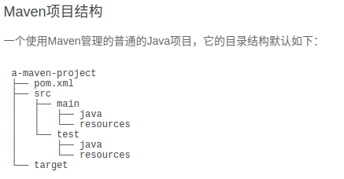

```
项目的根目录a-maven-project是项目名，它有一个项目描述文件pom.xml
存放Java源码的目录是src/main/java
存放资源文件的目录是src/main/resources
存放测试源码的目录是src/test/java
存放测试资源的目录是src/test/resources
最后，所有编译、打包生成的文件都放在target目录里。
这些就是一个Maven项目的标准目录结构。
```

​	pom.xml项目描述文件

```xml
<project ...>
	<modelVersion>4.0.0</modelVersion>
	<groupId>com.itranswarp.learnjava</groupId>
	<artifactId>hello</artifactId>
	<version>1.0</version>
	<packaging>jar</packaging>
	<properties>
        ...
	</properties>
	<dependencies>
        <dependency>
            <groupId>commons-logging</groupId>
            <artifactId>commons-logging</artifactId>
            <version>1.2</version>
        </dependency>
	</dependencies>
</project>
```

​	`groupId`类似于Java的包名，通常是公司或组织名称

​	`artifactId`类似于Java的类名，通常是项目名称，再加上`version`

​	一个Maven工程就是由`groupId`，`artifactId`和`version`作为唯一标识。

​	我们在引用其他第三方库的时候，也是通过这3个变量确定。

```xml
<dependency>
    <groupId>commons-logging</groupId>
    <artifactId>commons-logging</artifactId>
    <version>1.2</version>
</dependency>
```

​	使用`<dependency>`声明一个依赖后，Maven就会自动下载这个依赖包并把它放到classpath中。

​	Maven安装

## 依赖管理

​	Maven的作用就是解决依赖管理（解决依赖和依赖的依赖）；

​	Maven定义了几种依赖关系，分别是`compile`、`test`、`runtime`和`provided`；

| scope    | 说明                                          | 示例            |
| :------- | :-------------------------------------------- | :-------------- |
| compile  | 编译时需要用到该jar包（默认）                 | commons-logging |
| test     | 编译Test时需要用到该jar包                     | junit           |
| runtime  | 编译时不需要，但运行时需要用到                | mysql           |
| provided | 编译时需要用到，但运行时由JDK或某个服务器提供 | servlet-api     |

​	`provided`依赖表示编译时需要，但运行时不需要；

​	Maven如何知道从何处下载所需的依赖？也就是相关的jar包？

​	答案是Maven维护了一个中央仓库（[repo1.maven.org](https://repo1.maven.org/)），所有第三方库将自身的jar以及相关信息上传至中央仓库，Maven就可以从中央仓库把所需依赖下载到本地。

​	Maven并不会每次都从中央仓库下载jar包。一个jar包一旦被下载过，就会被Maven自动缓存在本地目录（用户主目录的`.m2`目录），所以，除了第一次编译时因为下载需要时间会比较慢，后续过程因为有本地缓存，并不会重复下载相同的jar包。

### 唯一ID

对于某个依赖，Maven只需要3个变量即可唯一确定某个jar包：

- groupId：属于组织的名称，类似Java的包名；
- artifactId：该jar包自身的名称，类似Java的类名；
- version：该jar包的版本。

​	通过上述3个变量，即可唯一确定某个jar包。Maven通过对jar包进行PGP签名确保任何一个jar包一经发布就无法修改。修改已发布jar包的唯一方法是发布一个新版本。

​	除了可以从Maven的中央仓库下载外，还可以从Maven的镜像仓库下载。

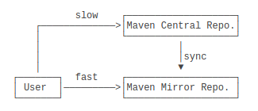

​	使用Maven镜像仓库需要一个配置，在用户主目录下进入`.m2`目录，创建一个`settings.xml`配置文件，内容如下：

```xml
<settings>
    <mirrors>
        <mirror>
            <id>aliyun</id>
            <name>aliyun</name>
            <mirrorOf>central</mirrorOf>
            <!-- 国内推荐阿里云的Maven镜像 -->
            <url>https://maven.aliyun.com/repository/central</url>
        </mirror>
    </mirrors>
</settings>
```

### 搜索第三方组件

​	如果我们要引用一个第三方组件，比如`okhttp`，如何确切地获得它的`groupId`、`artifactId`和`version`？方法是通过[search.maven.org](https://search.maven.org/)搜索关键字，找到对应的组件后，直接复制；

### 命令行编译

​	进入到`pom.xml`所在目录，输入以下命令

```java
mvn clean package
```

​	如果一切顺利，即可在`target`目录下获得编译后自动打包的jar。

### 构建流程

​	Maven不但有标准化的项目结构，而且还有一套标准化的构建流程，可以自动化实现编译，打包，发布，等等。

#### 生命周期（lifecycle）

​	Maven的生命周期由一系列阶段（phase）构成，以内置的生命周期`default`为例，它包含以下phase：

```java
validate
initialize
generate-sources
process-sources
generate-resources
process-resources
compile
process-classes
generate-test-sources
process-test-sources
generate-test-resources
process-test-resources
test-compile
process-test-classes
test
prepare-package
package
pre-integration-test
integration-test
post-integration-test
verify
install
deploy
```

如果我们运行`mvn package`，Maven就会执行`default`生命周期，它会从开始一直运行到`package`这个phase为止：

- validate
- ...
- package

如果我们运行`mvn compile`，Maven也会执行`default`生命周期，但这次它只会运行到`compile`，即以下几个phase：

- validate
- ...
- compile

Maven另一个常用的生命周期是`clean`，它会执行3个phase：

- pre-clean
- clean （注意这个clean不是lifecycle而是phase）
- post-clean

所以，我们使用`mvn`这个命令时，后面的参数是phase，Maven自动根据生命周期运行到指定的phase。

在实际开发过程中，经常使用的命令有：

```java
mvn clean：清理所有生成的class和jar；
mvn clean compile：先清理，再执行到compile；
mvn clean test：先清理，再执行到test，因为执行test前必须执行compile，所以这里不必指定compile；
mvn clean package：先清理，再执行到package。
```

#### Goal

​	执行一个phase又会触发一个或多个goal；

| 执行的Phase | 对应执行的Goal                     |
| :---------- | :--------------------------------- |
| compile     | compiler:compile                   |
| test        | compiler:testCompile surefire:test |

​	goal的命名总是`abc:xyz`这种形式。

- lifecycle相当于Java的package，它包含一个或多个phase；
- phase相当于Java的class，它包含一个或多个goal；
- goal相当于class的method，它其实才是真正干活的。

Maven通过lifecycle、phase和goal来提供标准的构建流程。

#### 流程图

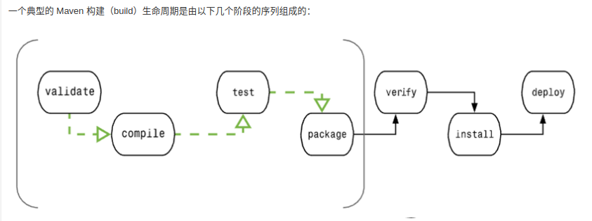

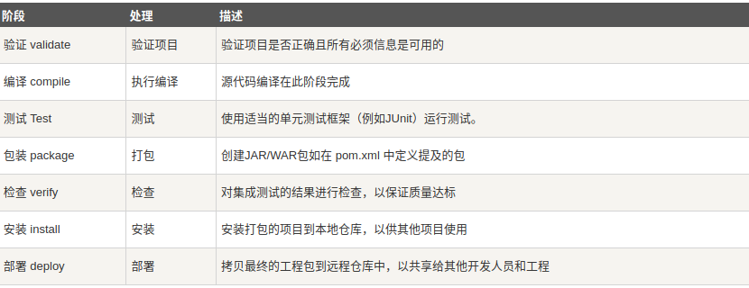

### 使用插件

​	使用Maven构建项目就是执行lifecycle，执行到指定的phase为止。每个phase会执行自己默认的一个或多个goal。goal是最小任务单元。

​	我们以`compile`这个phase为例，如果执行：

```java
mvn compile
```

​	Maven将执行`compile`这个phase，这个phase会调用`compiler`插件执行关联的`compiler:compile`这个goal。

​	执行每个phase，都是通过某个插件（plugin）来执行的，Maven本身其实并不知道如何执行`compile`，它只是负责找到对应的`compiler`插件，然后执行默认的`compiler:compile`这个goal来完成编译。

​	所以，使用Maven，实际上就是配置好需要使用的插件，然后通过phase调用它们。

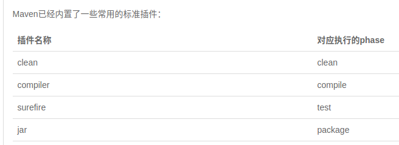

下面列举了一些常用的插件：

- maven-shade-plugin：打包所有依赖包并生成可执行jar；
- cobertura-maven-plugin：生成单元测试覆盖率报告；
- findbugs-maven-plugin：对Java源码进行静态分析以找出潜在问题。

### 模块管理

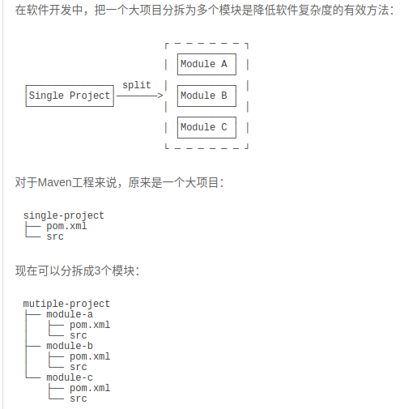

​	Maven可以有效地管理多个模块，我们只需要把每个模块当作一个独立的Maven项目，它们有各自独立的`pom.xml`

​	pom.xml可以提取共同点，进行继承简化；

### 使用mvnw

​	`mvnw`是Maven Wrapper的缩写。因为我们安装Maven时，默认情况下，系统所有项目都会使用全局安装的这个Maven版本。但是，对于某些项目来说，它可能必须使用某个特定的Maven版本，这个时候，就可以使用Maven Wrapper，它可以负责给这个特定的项目安装指定版本的Maven，而其他项目不受影响。

​	简单地说，Maven Wrapper就是给一个项目提供一个独立的，指定版本的Maven给它使用。

### 发布Artifact

​	如果我们把自己的开源库放到Maven的repo中，那么，别人只需按标准引用`groupId:artifactId:version`，即可自动下载jar包以及相关依赖。

​	把自己的库发布到Maven的repo中有好几种方法，我们介绍3种最常用的方法。

#### 以静态文件发布

​	示例：

​	发布在中央仓库的文件夹路径：https://repo1.maven.org/maven2/org/apache/commons/commons-math3/3.6.1/

​	在此文件夹下：

​	`commons-math3-3.6.1.jar`就是发布的jar包

​	`commons-math3-3.6.1.pom`就是它的`pom.xml`描述文件

​	`commons-math3-3.6.1-sources.jar`是源代码

​	`commons-math3-3.6.1-javadoc.jar`是文档。

​	其它以`.asc`、`.md5`、`.sha1`结尾的文件分别是GPG签名、MD5摘要和SHA-1摘要。


​	`<distributionManagement>`，它指示了发布的软件包的位置，这里的`<url>`是项目根目录下的`maven-repo`目录，在`<build>`中定义的两个插件`maven-source-plugin`和`maven-javadoc-plugin`分别用来创建源码和javadoc，如果不想发布源码，可以把对应的插件去掉。

#### 通过Nexus发布到中央仓库


#### 发布到私有仓库

# 网络编程


## XML与JSON


## JDBC编程


## 函数式编程


## 设计模式


## Web开发

# Spring开发

​	Spring是一个支持快速开发Java EE应用程序的框架。它提供了一系列底层容器和基础设施，并可以和大量常用的开源框架无缝集成，可以说是开发Java EE应用程序的必备。

​	Spring Framework主要包括几个模块：

- 支持IoC和AOP的容器；
- 支持JDBC和ORM的数据访问模块；
- 支持声明式事务的模块；
- 支持基于Servlet的MVC开发；
- 支持基于Reactive的Web开发；
- 以及集成JMS、JavaMail、JMX、缓存等其他模块。

## Ioc容器

​	什么是容器？容器是一种为某种特定组件的运行提供必要支持的一个软件环境。

​	例如，Tomcat就是一个Servlet容器，它可以为Servlet的运行提供运行环境。

​	类似Docker这样的软件也是一个容器，它提供了必要的Linux环境以便运行一个特定的Linux进程。


​	通常来说，使用容器运行组件，除了提供一个组件运行环境之外，容器还提供了许多底层服务。

​	例如，Servlet容器底层实现了TCP连接，解析HTTP协议等非常复杂的服务，如果没有容器来提供这些服务，我们就无法编写像Servlet这样代码简单，功能强大的组件。

​	早期的JavaEE服务器提供的EJB容器最重要的功能就是通过声明式事务服务，使得EJB组件的开发人员不必自己编写冗长的事务处理代码，所以极大地简化了事务处理。

​	Spring的核心就是提供了一个IoC容器，它可以管理所有轻量级的JavaBean组件，提供的底层服务包括组件的生命周期管理、配置和组装服务、AOP支持，以及建立在AOP基础上的声明式事务服务等。

### Ioc原理

​	IoC全称Inversion of Control，直译为控制反转。

​	传统的应用程序中，控制权在程序本身，程序的控制流程完全由开发者控制；

​	在IoC模式下，控制权发生了反转，即从应用程序转移到了IoC容器，所有组件不再由应用程序自己创建和配置，而是由IoC容器负责，这样，应用程序只需要直接使用已经创建好并且配置好的组件。

​	为了能让组件在IoC容器中被“装配”出来，需要某种“注入”机制；

```java
public class BookService {
    private DataSource dataSource;

    public void setDataSource(DataSource dataSource) {
        this.dataSource = dataSource;
    }
}
```

​	例如，`BookService`自己并不会创建`DataSource`，而是等待外部通过`setDataSource()`方法来注入一个`DataSource`；

​	不直接`new`一个`DataSource`，而是注入一个`DataSource`，这个小小的改动虽然简单，却带来了一系列好处：

```
BookService不再关心如何创建DataSource，因此，不必编写读取数据库配置之类的代码；
DataSource实例被注入到BookService，同样也可以注入到UserService，因此，共享一个组件非常简单；
测试BookService更容易，因为注入的是DataSource，可以使用内存数据库，而不是真实的MySQL配置。
```

​	因此，IoC又称为依赖注入（DI：Dependency Injection），它解决了一个最主要的问题：将组件的创建+配置与组件的使用相分离，并且，由IoC容器负责管理组件的生命周期。

​	因为IoC容器要负责实例化所有的组件，因此，有必要告诉容器如何创建组件，以及各组件的依赖关系。一种最简单的配置是通过XML文件来实现；

```xml
<beans>
    <bean id="dataSource" class="HikariDataSource" />
    <bean id="bookService" class="BookService">
        <property name="dataSource" ref="dataSource" />
    </bean>
    <bean id="userService" class="UserService">
        <property name="dataSource" ref="dataSource" />
    </bean>
</beans>
```

​	在Spring的IoC容器中，我们把所有组件统称为JavaBean，即配置一个组件就是配置一个Bean。

#### 依赖注入方式

​	依赖注入可以通过`set()`方法实现，也可以通过构造方法实现。

```java
public class BookService {
    private DataSource dataSource;

    public BookService(DataSource dataSource) {
        this.dataSource = dataSource;
    }
}
```

​	Spring的IoC容器同时支持属性注入和构造方法注入，并允许混合使用。

#### 无侵入容器

​	在设计上，Spring的IoC容器是一个高度可扩展的无侵入容器。所谓无侵入，是指应用程序的组件无需实现Spring的特定接口，或者说，组件根本不知道自己在Spring的容器中运行。这种无侵入的设计有以下好处：

1. 应用程序组件既可以在Spring的IoC容器中运行，也可以自己编写代码自行组装配置；
2. 测试的时候并不依赖Spring容器，可单独进行测试，大大提高了开发效率。

## 装配Bean

​	为什么要使用Spring的IoC容器？ 因为让容器来为我们创建并装配Bean能获得很大的好处；

```xml
<?xml version="1.0" encoding="UTF-8"?>
<beans xmlns="http://www.springframework.org/schema/beans"
    xmlns:xsi="http://www.w3.org/2001/XMLSchema-instance"
    xsi:schemaLocation="http://www.springframework.org/schema/beans
        https://www.springframework.org/schema/beans/spring-beans.xsd">

    <bean id="userService" class="com.itranswarp.learnjava.service.UserService">
        <property name="mailService" ref="mailService" />
    </bean>

    <bean id="mailService" class="com.itranswarp.learnjava.service.MailService" />
</beans>
```

- 每个`<bean ...>`都有一个`id`标识，相当于Bean的唯一ID；
- 在`userService`Bean中，通过`<property name="..." ref="..." />`注入了另一个Bean；
- Bean的顺序不重要，Spring根据依赖关系会自动正确初始化。

​	翻译成java为：

```java
UserService userService = new UserService();
MailService mailService = new MailService();
userService.setMailService(mailService);
```

​	如果注入的不是Bean，而是`boolean`、`int`、`String`这样的数据类型，则通过`value`注入

```xml
<bean id="dataSource" class="com.zaxxer.hikari.HikariDataSource">
    <property name="jdbcUrl" value="jdbc:mysql://localhost:3306/test" />
    <property name="username" value="root" />
    <property name="password" value="password" />
    <property name="maximumPoolSize" value="10" />
    <property name="autoCommit" value="true" />
</bean>
```

​	最后一步，我们需要创建一个Spring的IoC容器实例，然后加载配置文件，让Spring容器为我们创建并装配好配置文件中指定的所有Bean，这只需要一行代码：

```java
ApplicationContext context = new ClassPathXmlApplicationContext("application.xml");
```

​	可以看到，Spring容器就是`ApplicationContext`，它是一个接口，有很多实现类，这里我们选择`ClassPathXmlApplicationContext`，表示它会自动从classpath中查找指定的XML配置文件。

​	获得了`ApplicationContext`的实例，就获得了IoC容器的引用。从`ApplicationContext`中我们可以根据Bean的ID获取Bean，但更多的时候我们根据Bean的类型获取Bean的引用：

```java
UserService userService = context.getBean(UserService.class);
```

​	Spring还提供另一种IoC容器叫`BeanFactory`，使用方式和`ApplicationContext`类似：

```java
BeanFactory factory = new XmlBeanFactory(new ClassPathResource("application.xml"));
MailService mailService = factory.getBean(MailService.class);
```

​	`BeanFactory`和`ApplicationContext`的区别在于：

​	`BeanFactory`的实现是按需创建，即第一次获取Bean时才创建这个Bean，而`ApplicationContext`会一次性创建所有的Bean。

​	实际上，`ApplicationContext`接口是从`BeanFactory`接口继承而来的，并且，`ApplicationContext`提供了一些额外的功能，包括国际化支持、事件和通知机制等。通常情况下，我们总是使用`ApplicationContext`，很少会考虑使用`BeanFactory`。

## 使用Annotation配置

​	使用Spring的IoC容器，实际上就是通过类似XML这样的配置文件，把我们自己的Bean的依赖关系描述出来，然后让容器来创建并装配Bean。一旦容器初始化完毕，我们就直接从容器中获取Bean使用它们。

​	使用XML配置的优点是所有的Bean都能一目了然地列出来，并通过配置注入能直观地看到每个Bean的依赖。它的缺点是写起来非常繁琐，每增加一个组件，就必须把新的Bean配置到XML中。

```java
@Component
public class MailService {
    ...
}
```

​	这个`@Component`注解就相当于定义了一个Bean，它有一个可选的名称，默认是`mailService`，即小写开头的类名。

```java
@Component
public class UserService {
    @Autowired
    MailService mailService;

    ...
}
```

​	我们给`UserService`添加一个`@Component`注解和一个`@Autowired`注解。使用`@Autowired`就相当于把指定类型的Bean注入到指定的字段中。

​	`@Autowired`大幅简化了注入，因为它不但可以写在`set()`方法上，还可以直接写在字段上，甚至可以写在构造方法中：

​	`@Configuration`，表示它是一个配置类；

​	`@ComponentScan`，它告诉容器，自动搜索当前类所在的包以及子包，把所有标注为`@Component`的Bean自动创建出来，并根据`@Autowired`进行装配。

​	使用Annotation配合自动扫描能大幅简化Spring的配置，我们只需要保证：

- 每个Bean被标注为`@Component`并正确使用`@Autowired`注入；
- 配置类被标注为`@Configuration`和`@ComponentScan`；
- 所有Bean均在指定包以及子包内。


## 定制Bean


## 注入配置


## 使用条件装配

# Spring Boot开发

